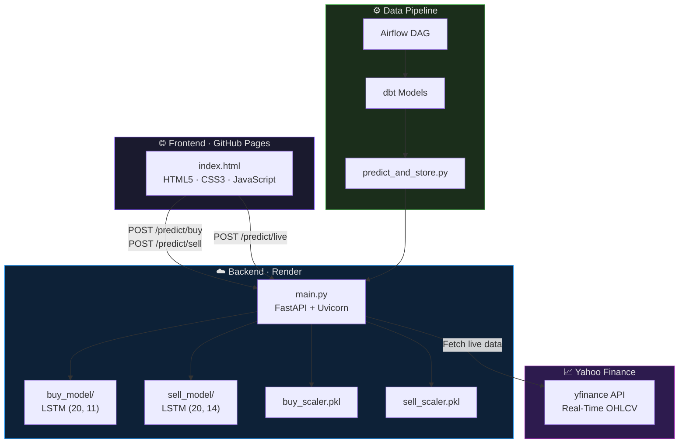

<div align="center">

# 🧠 AlphaQuant

### Deep Learning for Market Forecasting & Portfolio Optimization

**An End-to-End AI-Driven Quantitative Trading and Portfolio Management System**

[](https://www.python.org/)
[](https://www.tensorflow.org/)
[](https://fastapi.tiangolo.com/)
[](https://github.com/ranaroussi/yfinance)
[](https://airflow.apache.org/)
[](https://www.getdbt.com/)
[](https://deep-learning-market-forecasting-liyz.onrender.com)
[](https://hodatisg520.github.io/Deep-Learning-Market-Forecasting-Portfolio-Optimization/)

<br />

[**🚀 Try the Live App**](https://hodatisg520.github.io/Deep-Learning-Market-Forecasting-Portfolio-Optimization/) · [**📡 API Docs**](https://deep-learning-market-forecasting-liyz.onrender.com/docs) · [**📐 Architecture Docs**](data_pipeline_architecture.md)

</div>

---

## 📋 Table of Contents

- [Project Overview](#-project-overview)
- [✨ NEW — Live Prediction Feature](#-new--live-prediction-feature)
- [Core Capabilities](#-core-capabilities)
- [System Architecture](#-system-architecture)
- [Technology Stack](#-technology-stack)
- [Repository Structure](#-repository-structure)
- [API Reference](#-api-reference)
- [Setup & Usage](#-setup--usage)
- [Model Specifications](#-model-specifications)
- [Author](#-author)

---

## 🔭 Project Overview

**AlphaQuant** is a comprehensive, end-to-end quantitative finance and artificial intelligence system designed to analyze, forecast, and execute trading strategies on the Nasdaq and Vietnam (VN-Index) stock markets.

This project bridges the gap between theoretical deep learning models and industry-grade engineering practices. It encompasses the entire data lifecycle: from automated data ingestion and transformation pipelines (ELT) to the training of Long Short-Term Memory (LSTM) neural networks, risk-adjusted portfolio optimization, and final deployment as a production-ready Software-as-a-Service (SaaS) application.

> [!TIP]
> **Want to see it in action?** Click the **[Live App](https://hodatisg520.github.io/Deep-Learning-Market-Forecasting-Portfolio-Optimization/)** link above and hit the **"⚡ Live Predict"** button — the system will fetch real-time market data and return an AI prediction in seconds. No signup, no data entry required.

---

## ✨ NEW — Live Prediction Feature

The **Live Predict** feature is the flagship capability of AlphaQuant. With a single click, the system performs the following end-to-end workflow automatically:


| Step | What Happens |
|------|-------------|
| **1. Data Fetch** | The backend calls Yahoo Finance via `yfinance` to pull the latest 60 trading days of OHLCV data for ticker **SAM.VN** |
| **2. Feature Engineering** | Computes `SMA_14`, `log_return`, and `volatility_14` on the fly, then pads/aligns the feature matrix to match each model's expected input shape |
| **3. LSTM Inference** | Feeds the prepared 20-day sliding window into both the **Buy Model** (11 features) and **Sell Model** (14 features) |
| **4. Signal Generation** | Compares predicted probabilities against calibrated thresholds (Buy ≥ 0.40, Sell ≥ 0.55) and returns a clear **BUY**, **SELL**, or **HOLD** recommendation |

> [!NOTE]
> The live prediction currently targets **SAM.VN** (Sacombank Securities). The architecture is designed to be easily extensible to any ticker supported by Yahoo Finance.

---

## 🎯 Core Capabilities

### 1. Multi-Horizon Time-Series Forecasting
- **Architecture:** Custom LSTM networks optimized for non-stationary financial time-series data
- **Features:** Multi-dimensional input tensors incorporating OHLCV alongside calculated macroeconomic and technical indicators
- **Results:** Achieved a Mean Absolute Percentage Error (MAPE) of **1.93%** on sequential predictions via k-day trajectory forecasting

### 2. Algorithmic Trading Signal Classification
- **Feature Engineering:** Advanced statistical indicators including 14-day Rolling Volatility, Simple Moving Average (SMA), Relative Strength Index (RSI), Log Returns, and Bollinger Bands
- **Model Design:** Distinct binary classification models for optimal entry (Buy) and exit (Sell) signals
- **Optimization:** Custom loss weights to address class imbalance and minimize false negatives at critical market entry points

### 3. Quantitative Risk Management & Portfolio Construction
- **Risk Assessment:** Proprietary composite risk score utilizing AI-derived sell probabilities (50%), historical volatility (30%), and technical risk factors (20%)
- **Asset Allocation:** Modern Portfolio Theory (Markowitz Efficient Frontier) with `PyPortfolioOpt` and Ledoit-Wolf shrinkage for dynamic portfolio construction
- **Performance:** Expected annual return of **7.3%** under stringent risk constraints with maximized Sharpe Ratio

### 4. MLOps & Production Deployment
- **Backend:** TensorFlow models served via **FastAPI** + **Uvicorn** on Render with strict **Pydantic** schema validation
- **Frontend:** Zero-dependency SaaS interface (HTML5 + Vanilla JS) on GitHub Pages with async API communication
- **Live Data Pipeline:** Real-time Yahoo Finance integration via `yfinance` for zero-input predictions

### 5. Automated Data Engineering Workflow
- **Orchestration:** Apache Airflow DAGs for scheduled ingestion, transformation, and inference
- **Transformation:** dbt models with SQL Window Functions for in-database feature engineering (SMA, RSI, Volatility)
- **Inference Pipeline:** Automated prediction scripts for batch scoring and storage

---

## 🏗️ System Architecture



---

## 🛠️ Technology Stack

| Category | Technologies |
|----------|-------------|
| **Deep Learning & Mathematics** | TensorFlow · Keras · NumPy · Pandas · Scikit-learn · PyPortfolioOpt |
| **Live Market Data** | yfinance (Yahoo Finance real-time OHLCV) |
| **Backend Engineering** | Python 3.11 · FastAPI · Uvicorn · Pydantic · Joblib |
| **Data Engineering & MLOps** | Apache Airflow · dbt · PostgreSQL (Architecture Design) |
| **Frontend Development** | HTML5 · CSS3 · JavaScript (ES6) · Fetch API |
| **Infrastructure & Deployment** | Git · GitHub Pages · Render |

---

## 📁 Repository Structure

```text
AlphaQuant/
├── main.py                               # FastAPI application (root-level entry point)
├── index.html                            # SaaS web application (frontend client)
├── live_inference.py                     # Local script for testing live Yahoo Finance predictions
├── requirements.txt                      # Production backend dependencies
├── AlphaQuant_Model_Development.ipynb    # Model development, training & evaluation notebook
├── data_pipeline_architecture.md         # System architecture diagrams & workflow docs
│
├── my_stock_models/                      # Trained TensorFlow models & fitted scalers
│   ├── buy_model/                        #   LSTM buy-signal classifier (SavedModel format)
│   ├── sell_model/                       #   LSTM sell-signal classifier (SavedModel format)
│   ├── buy_scaler.pkl                    #   StandardScaler fitted for buy features
│   └── sell_scaler.pkl                   #   StandardScaler fitted for sell features
│
├── data_pipeline/                        # Automated data engineering pipeline
│   ├── airflow/dags/
│   │   └── stock_pipeline_dag.py         #   Airflow DAG for orchestration
│   ├── dbt/models/
│   │   └── stock_features.sql            #   dbt SQL transformation model
│   └── scripts/
│       └── predict_and_store.py          #   Batch inference & storage script
│
└── learning_materials/                   # Vietnamese-commented study files (not tracked)
```

---

## 📡 API Reference

The FastAPI backend exposes the following endpoints:

| Method | Endpoint | Description |
|--------|----------|-------------|
| `GET` | `/` | Root endpoint — API status and welcome message |
| `GET` | `/health` | Health check for monitoring and uptime probes |
| `POST` | `/predict/buy` | Run buy-signal inference on a 20×11 feature matrix |
| `POST` | `/predict/sell` | Run sell-signal inference on a 20×14 feature matrix |
| `POST` | `/predict/live` | **⚡ Live Predict** — Fetches real-time Yahoo Finance data and runs both models |
| `GET` | `/features/buy` | Returns the list of expected feature names for the buy model |
| `GET` | `/features/sell` | Returns the list of expected feature names for the sell model |

> [!IMPORTANT]
> The interactive API documentation (Swagger UI) is available at:
> **[https://deep-learning-market-forecasting-liyz.onrender.com/docs](https://deep-learning-market-forecasting-liyz.onrender.com/docs)**

---

## 🚀 Setup & Usage

### Option 1: Use the Live SaaS Application (No Install Required)

The system is fully deployed to the cloud. No local dependencies needed.

1. Navigate to the **[AlphaQuant Web App](https://hodatisg520.github.io/Deep-Learning-Market-Forecasting-Portfolio-Optimization/)**
2. **⚡ Live Predict (Recommended):** Click the **"Live Predict"** button — the system automatically fetches real-time data from Yahoo Finance for **SAM.VN** and returns an AI-powered BUY/SELL/HOLD recommendation instantly
3. **Manual Predict:** Click **"Load Sample Data"** to populate the matrix with 20 days of historical indicators, then click **"Predict Signal"** to run inference
4. The system asynchronously returns the predicted probability and trading recommendation

### Option 2: Run the API Locally (Development)

```bash
# 1. Clone the repository
git clone https://github.com/hodatisg520/Deep-Learning-Market-Forecasting-Portfolio-Optimization.git
cd Deep-Learning-Market-Forecasting-Portfolio-Optimization

# 2. Create and activate a Python 3.11 virtual environment
python3.11 -m venv venv
source venv/bin/activate  # macOS/Linux
# venv\Scripts\activate   # Windows

# 3. Install dependencies
pip install -r requirements.txt

# 4. Start the FastAPI server
uvicorn main:app --host 0.0.0.0 --port 8000 --reload
```

- **Swagger UI:** [http://localhost:8000/docs](http://localhost:8000/docs)
- **Frontend:** Open `index.html` in your browser and update the `API_BASE_URL` variable in the JavaScript code to `http://localhost:8000`

### Option 3: Run Live Inference Locally (CLI)

Test real-time Yahoo Finance predictions from the command line without starting the API server:

```bash
python live_inference.py
```

This script fetches live market data for SAM.VN, engineers features, and prints buy/sell predictions directly to the terminal.

### Option 4: Model Training & Development

1. Open `AlphaQuant_Model_Development.ipynb` in **Google Colab** or your preferred Jupyter environment
2. Upload the required CSV datasets (historical data, financial ratios, ticker overview) into the corresponding directory structure
3. Configure the `base_path` variable to point to your data directory
4. Execute cells sequentially to observe the full pipeline: data preprocessing → model training → convergence → Markowitz portfolio optimization

---

## 📊 Model Specifications

| Specification | Buy Model | Sell Model |
|--------------|-----------|------------|
| **Architecture** | LSTM (Sequential) | LSTM (Sequential) |
| **Input Shape** | `(20, 11)` — 20 timesteps × 11 features | `(20, 14)` — 20 timesteps × 14 features |
| **Decision Threshold** | ≥ 0.40 → **BUY** | ≥ 0.55 → **SELL** |
| **Scaler** | StandardScaler (`buy_scaler.pkl`) | StandardScaler (`sell_scaler.pkl`) |
| **Framework** | TensorFlow / Keras | TensorFlow / Keras |
| **Format** | TensorFlow SavedModel | TensorFlow SavedModel |

**Live-Engineered Features:** `SMA_14`, `log_return`, `volatility_14` — computed in real-time from Yahoo Finance OHLCV data via `yfinance`

---

## 👤 Author

<div align="center">

**Nguyen Hong Dang**

[](https://github.com/hodatisg520)

</div>

---

<div align="center">

⚠️ **Disclaimer**

*This repository and its associated models are developed strictly for portfolio demonstration and educational purposes. The predictions generated by these models do not constitute financial advice. Always consult a qualified financial advisor before making investment decisions.*

</div>
