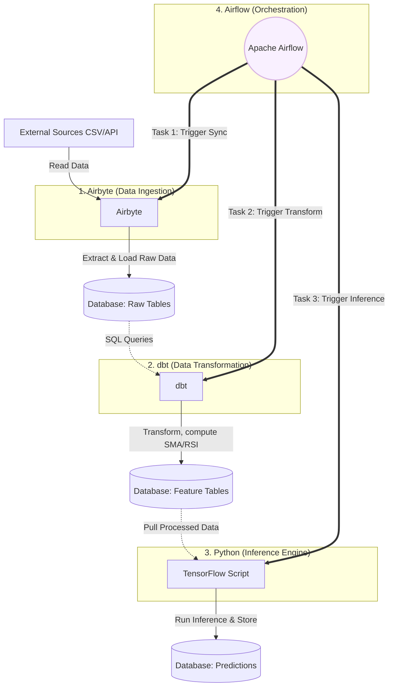

# Data Engineering & MLOps Architecture

## 1. Overall Objective
The goal of this data pipeline is to establish a fully **Automated Engineering Workflow**, transforming a static Deep Learning model developed in Jupyter Notebooks into a production-ready system. 
This architecture covers the entire data lifecycle: from automated Ingestion, in-database Transformation, inference Prediction, to final Storage, ensuring a continuous and consistent flow of data.

## 2. System Architecture Diagram
The data pipeline is designed using an **ELT (Extract, Load, Transform)** paradigm integrated with deep learning inference operations.

## 3. Pipeline Components & Tool Interactions

This system utilizes modern industry-standard data engineering tools, orchestrated in a robust sequence:

### Step 1: Airbyte (Data Ingestion)
- **Role:** Handles the Extract and Load phases.
- **Operation:** Airbyte connects to external data sources (e.g., historical CSVs or live APIs for Nasdaq/VN-Index). On a scheduled basis, Airbyte automatically synchronizes and loads this raw data into a centralized database (such as PostgreSQL or MongoDB) into designated raw tables (`raw_daily_prices`). This guarantees the database is continually populated with fresh data without manual intervention.

### Step 2: dbt - Data Build Tool (Data Transformation)
- **Role:** Executes the Transform phase directly within the data warehouse/database.
- **Operation:** Once raw data is ingested, dbt executes SQL transformations (`stock_features.sql`) to clean and enrich the data. It handles null values and computes complex technical indicators (e.g., Simple Moving Average - SMA, Relative Strength Index - RSI, Volatility) using highly optimized SQL Window Functions. The transformed data is materialized as a new table (`stock_features`), readily available for machine learning consumption. Utilizing dbt leverages the database's parallel computing capabilities, scaling much more efficiently than in-memory pandas operations.

### Step 3: Python Script (Inference & Storage)
- **Role:** Executes deep learning model inference (TensorFlow/Keras).
- **Operation:** A scheduled Python script (`predict_and_store.py`) retrieves the latest 20 trading days from the newly transformed `stock_features` table. It reshapes the data into 3D tensors and feeds it into the pre-trained LSTM networks to generate directional probabilities. The system then writes the prediction outputs (e.g., `BUY` with `0.85` confidence) back into a dedicated database table (`stock_predictions`). This table acts as the serving layer for BI tools like Superset or Tableau for dashboard visualization.

### Step 4: Apache Airflow (Orchestration)
- **Role:** The core orchestrator managing the execution sequence.
- **Operation:** Airflow utilizes a **DAG (Directed Acyclic Graph)** to schedule and monitor the pipeline execution (e.g., daily at 16:30 after market close).
  - First, Airflow triggers the Airbyte ingestion sync.
  - Upon successful completion, it triggers the dbt transformation run.
  - Finally, it activates the Python inference script.
  - This strict dependency chain (`Airbyte >> dbt >> Python`) guarantees data integrity. If any upstream task fails, Airflow halts downstream execution and sends alerts, preventing corrupted or stale data from reaching the prediction model.

## 4. Conclusion
Integrating Airbyte, dbt, Airflow, and TensorFlow establishes an automated forecasting pipeline that adheres to modern MLOps (Machine Learning Operations) standards. This architecture cleanly decouples Data Engineering concerns from Data Science workflows, resulting in a system that is transparent, highly maintainable, and easily scalable for future enhancements.
